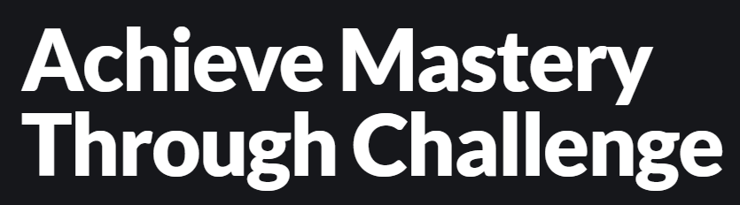
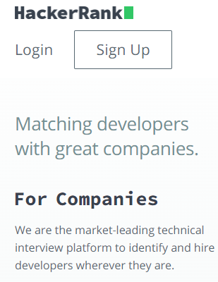

# DOM_JS_Excercise
# Dom Manipulation Assignment

1. Webiste Name: [Dev To](https://dev.to/)

### Topics

    - Query Selctory, Inner HTML

### Sample Image


### Tasks

        Target the Top description div and change the DEV Community to <Your_Name> and description to your passion

### Output


### My Output

```
const heading = document.querySelector(".crayons-card .crayons-subtitle-2");
heading.innerHTML = "Swadhina Patel";
const passion = document.querySelector(".crayons-card .color-base-70");
passion.innerHTML =
  "i am full stack developer";

```

2. Website Name: [Apple](https://support.apple.com/en-in)

### Task


### Fetch all the product name and store in an array

### Output

['iPhone', 'Mac', 'iPad', 'Watch', 'AirPods', 'Music', 'TV']

### My Output

```
const row = document.querySelector(".as-imagegrid--7up .row").childNodes;

function getProduct() {
  const products = [];
  for (let e of row) {
    e.firstElementChild
      ? products.push(
          e.firstElementChild.getAttribute("data-analytics-link-component_name")
        )
      : null;
  }
  return products;
}

```

3. Webiste Name: [Youtube Support](https://support.google.com/youtube/)

### Topics

    - Get Element By Id, Create Element, Create Text Node, Append Child

### Sample Image


### Tasks

     Add another FAQ 'My New FAQ' to the list

### Output


### My Output

```
let nav = document.querySelector(".article .accordion-homepage");
let section = document.createElement("section");

section.className = "parent";
section.appendChild(document.createElement("h3"));
section.querySelector("h3").textContent = "My New FAQ";

nav.appendChild(section);

```

4. Webiste Name: [OnePlus](https://www.oneplus.in/support)

### Topics

     Query Selector, InnerText

### Sample Image


### Tasks

      Change the contact number

### Output


### My Output

```
const contact = document.querySelector(".customer-support");
contact.querySelector(".one-tel-number").innerHTML = "+91 9090428546";

```

5. Webiste Name: [Samsung](https://www.samsung.com/in/offer/online/samsung-fest/)

### Topics

       getElementById, createElement, InnerText, append, setAttribute

### Sample Image


### Tasks

     Target the main div of card and change the Button text to Check out

### Output


### My Output

```
document.querySelector(".feature-column-carousel__button .cta").innerText = "Check Out";

```

6. Webiste Name: [Adidas](https://www.adidas.co.in/)

### Topics

    -   Query Selector, Event listeners, Changing Styles

### Sample Image


### Tasks

     Target the search box and on hover change thebackground color to red.

### Output


### My Output


```
const searchBox = document.querySelector(".searchinput___zXLAR");
searchBox.addEventListener("mouseover", (e) => {
  searchBox.style.background = "red";
});
searchBox.addEventListener("mouseout", (e) => {
  searchBox.style.background = "white";
});

```

7. Webiste Name: [MDN Web Docs](https://developer.mozilla.org/en-US/)

### Topics

       Form, Value, Submit

### Sample Image


### Tasks

     To Search a topic in the MDN Search bar.
     First add a text to search in the search bar and then hit the submit search button to search the docs using DOM

### Output


### My Output

```
function search(Text) {
    let input = document.querySelector("#hp-search-input");
    input.value = Text;
    let form = document.querySelector("#hp-search-form");
    form.submit();
  }
  search("CSS Selector");
```

8. Webiste Name: [Google](https://www.google.com/)

### Topics

       Remove Elements

### Sample Image


### Tasks

     Remove alternate languages from the home page languages listed

### Output


### My Output

```
const elements = document.querySelectorAll("#SIvCob a");
for (i = 0; i < elements.length; i++) {
  if(i % 2 == 0) {
    elements[i].remove();
  }
}
console.log(elements);

```

9. Webiste Name: [Code Wars](https://www.codewars.com/)

### Topics

       Change Font Family, Color of Text.

### Sample Image



### Tasks

    Change the font family of the text to monospace and text color to the logo’s background color.

### Output


### My Output

```
const text = document.querySelector(".display-heading-1");
text.style.color = "#b1361e";
text.style.fontFamily = "monospace";

```

10. Webiste Name: [Freecodecamp](https://www.freecodecamp.org/)

### Topics

       querySelector, mouseover, click eventListener,  callback function, style,

### Sample Image


### Tasks

    Target the button and change background colour on mouseover

### Output


### My Output

```
const button = document.querySelector(".col-lg-8 .btn-cta-big");
const buttonText = document.querySelector(
  ".col-lg-8 .btn-cta-big .login-btn-text"
);

// on hover
button.addEventListener("mouseover", () => {
  buttonText.style.background = "red";
});

// remove hover effect 
button.addEventListener("mouseout", () => {
  buttonText.style.background = "transparent";
});

```

11. Webiste Name: [realme](https://www.realme.com/in/)

### Topics

       querySelector,style,background-image

### Sample Image


### Tasks

    change the realme logo to ineuron logo

### Output


### My Output

```
document.querySelector(".logo .icon").style.backgroundImage = "url('https://ineuron.ai/images/ineuron-logo.png')";
```

12. Webiste Name: [Github](https://github.com/)

### Topics

       querySelector,style,background-Color

### Sample Image


### Tasks

     change the background colour of the button to blue.

### Output


### My Output

```
document.querySelector(".border-bottom  [href='/new']").style.background ="blue";

```

13. Webiste Name: [Hackerrank](https://www.hackerrank.com/)

### Topics

       querySelector,innerHtml

### Sample Image



### Tasks

Target the top description and change “Matching developers with great companies” to ‘JSBOOTCAMP“.

### Output


### My Output

```
document.querySelector(".fl-heading-text").innerText = "JSBOOTCAMP";

```

14. Webiste Name: [Asus](https://www.asus.com/in/)

### Topics

      querySelector,style,font-size

### Sample Image


### Tasks

       change the fontsize of “Hot Deals” to 80px

### Output


### My Output

```
document.querySelector(".HotDealsAll__Heading__2fIbe").style.fontSize = "80px";

```

15. Webiste Name: [Dell](https://www.dell.com/en-in/shop/deals/laptop-deals?gacd=10415953-9016-5761040-285981356-0&dgc=ST&gclid=Cj0KCQjwguGYBhDRARIsAHgRm4-XUDMhhVNyHXb3s1gY4ZBzORr_d9Se-buhJwy7asyUe7YdqEA11eEaAt6UEALw_wcB&gclsrc=aw.ds&nclid=BxjBlpBQsX6pjSHh-L8YYSU77EpfXRkG1AGMB5Wbeu386ykspfrPDnfx_DdFau20)

### Topics

      querySelector,style.textAlign

### Sample Image


### Tasks

       Convert the text “G15 Gaming Laptop” from left to right

### Output


### My Output

```
document.querySelector(".ps-top .ps-title").style.textAlign = "right";

```

16. Webiste Name: [Vercel](https://vercel.com/)

### Topics

     querySelector,innerHTMl

### Sample Image


### Tasks

      change the heading “Start with the developer” to “Start with Scratch”

### Output


### My Output

```
const heading = document.querySelector(".section-title_title__VEDfK");
heading.textContent = "start from scratch";

```

17. Webiste Name: [Sony](https://www.sony.co.in/)

### Topics

    querySelector,innerHTMl

### Sample Image


### Tasks

     change the button text To current Date.

### Output


### My Output

```
const button = document.querySelector(".btn-container .btn")
button.textContent = new Date 

```

18. Webiste Name: [Philips](https://www.philips.co.in/)

### Topics

     querySelector,style,backgroundcolor

### Sample Image


### Tasks

    change the background colour blue to orange

### Output


### My Output

```
const footer = document.querySelector(".p-f03-footer-container");
footer.style.background = "orange";

```

19. Webiste Name: [Canon](https://in.canon/)

### Topics

          querySelector,src

### Sample Image


### Tasks

    extract the canon logo

### Output


### My Output

```
const imageSrc = document.querySelector(".navbar-brand .logo").src;

```


20. Webiste Name: [Oppo](https://www.oppo.com/in/)

### Topics

          querySelector,style,color

### Sample Image


### Tasks

      Change the description colour black to orange

### Output


### My Output

```
const description = document.querySelector(".wide .desc");
description.style.color = "orange";
```
